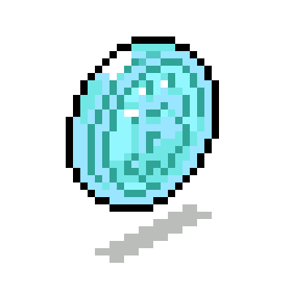

# Hi there  I'm Tushar - aka [ tsaxena4k,3k,2k...] 
   

## I'm a Student👨‍🎓Developer👨‍💻 Engineer🦸‍♂️ and Tech Enthusiast!🤖

- #### 👦 Also,I am 
   - currently working on many Projects & Ideas 💡
   - doing lots of debugging 🔨
   - looking for opportunities 🔆
   - trying to figure out life 🤣
- #### 🥅 2021 Goals
  - Contribute more to 
  - Still wear a 😷 and maintain social distancing 👣 (Kinda 🤭)
  - Make every freakn second count 😤
  - Explore more, seek for things neva done before 🌏

- #### ⚡ Fun facts
	- I love to sketch & DIY stuff✏️
	- my inverse is a Gamer 🎮
	- Like graphic designing & Illustration 🔥
	
- #### 📝 Blogs 
	- [Integrating Leaflet.js with Next.js](https://dev.to/tsaxena4k/integrating-next-js-with-leaflet-js-mapbox-1351)
		

## Languages and Tools 🛠️

 
 

  | 
------ | ------

### `Spotify Playing 🎧`

### `Come Find Me`

[][twitter]
[][linkedin]
[][instagram]
[][facebook]
[][stackoverflow]
[][discord]
[][pinterest]
[][dribble]
[][codepen]

 

---

[twitter]: https://twitter.com/tsaxena4k
[instagram]: https://www.instagram.com/tsaxena4k/
[linkedin]: https://www.linkedin.com/in/tushar-saxena-94b742184/
[facebook]: https://www.facebook.com/tushar.saxena.56232
[stackoverflow]: https://stackoverflow.com/users/14212597/tushar-saxena
[discord]: https://discord.gg/cvqaGJ
[pinterest]: https://in.pinterest.com/tusharsaxena562/
[dribble]: https://dribbble.com/tsaxen3k
[codepen]: https://codepen.io/tsaxena4k
